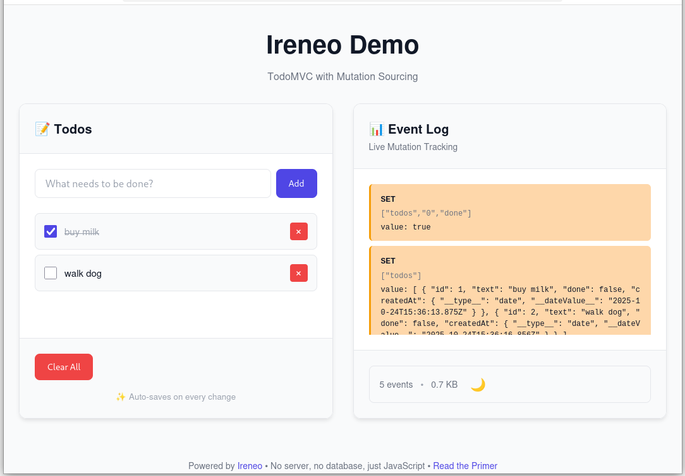

# Ireneo

**Event-sourced transparent persistence for JavaScript**

<br>

<p align="center">
<em>In memoriam: <a href="https://en.wikipedia.org/wiki/Funes_the_Memorious">Ireneo Funes</a> (1868–1889), who kept a perfect log of his existence<br>
and died young from the burden of remembering it all.</em>
</p>

<br>

**No databases. No ORMs. No serialization code.** Just plain JavaScript objects that remember everything—automatically, transparently, forever. Meet Ireneo: persistence without the ceremony.

<br>



## ⚡ Try It Now (Zero Setup)

You can try it [online](https://xrrocha.github.io/ireneo.html) (runs *locally* in your browser; absolutely none of your data sent anywhere).

Or, to run it on your own machine:

1. Download [`dist/demo.html`](https://github.com/xrrocha/ireneo/raw/main/dist/demo.html) — one self-contained 33KB file
2. Open it in your browser (works with `file://` protocol—no server needed)
3. Click **"Load Example"** to see mutation sourcing in action
4. **Watch the event log** update live as you add, toggle, and delete todos
5. Make changes—reload the page, your data is still there (persisted in IndexedDB)

**That's it.** No npm install. No database. No configuration. Just open and start exploring.

[Read the Primer](./docs/primer.md) to understand how it works.

## Overview

Ireneo provides transparent, event-sourced persistence for JavaScript objects through intelligent proxy-based mutation tracking. Write normal JavaScript code - Ireneo automatically captures every change as events, enabling time-travel debugging, audit trails, and complete application state recovery. Runs on both the browser and the server.

### Why Ireneo?

**You don't persist data—you persist *mutations* to your data.**

Most JavaScript apps struggle with persistence: ORMs add complexity, `JSON.stringify` is manual and error-prone, Redux requires boilerplate. Ireneo takes a radical approach: keep your entire dataset in RAM as plain JavaScript objects, log only the changes.

**Key insights:**

- 🧠 **Your data fits in memory** - Most apps use <100MB. Your laptop has 8GB+. No database needed for 80% of applications.

- 🔍 **JavaScript IS the query language** - No SQL, no ORM, no query builder. Just `.filter()`, `.map()`, `.reduce()`. Use the language you already know.

- 🎯 **Zero boilerplate** - Mutate objects naturally (`root.todos.push(...)`). Ireneo captures changes automatically via Proxies. No serialization code.

- 💾 **Safe as a database** - Events written to durable storage (IndexedDB, file system) immediately. Survives crashes and restarts.

- 🚫 **No impedance mismatch** - Work with native JavaScript objects, not database rows. No mapping, no schemas, no migrations.

- ⏱️ **Time-travel debugging** - Replay events to any point in history. Every mutation logged with full audit trail.

[Read the Primer](./docs/primer.md) to understand the Memory Image pattern and see comprehensive examples.

---

**⚠️ Development Status**

Ireneo is in active development. Currently supports: primitives, objects, arrays, Maps, Sets, Dates, RegExps, and class instances. Nested Map mutations fully supported as of v0.1.0.

**Roadmap:**
- Error types (TypeError, ReferenceError, etc.)
- Binary data (ArrayBuffer, TypedArray, DataView)
- MessagePack serialization

For production use, verify your data types are supported. See [test coverage](./test/README.md) for details.

### Production Readiness

**✅ Battle-Tested:** Core functionality (656 passing tests, 94.74% coverage), nested collections, transactions, class instances, circular references, time-travel debugging.

**⚠️ Limitations:** Incomplete RFC implementation (Error/Binary types, MessagePack); browser/Deno/Bun need testing; no performance benchmarks yet; single-process only.

**✅ Ready for:** Node.js apps with supported types, RAM-sized datasets, last-write-wins conflict resolution.

See [docs/ireneo-rfc.md](./docs/ireneo-rfc.md) for complete roadmap.

---

## Quick Start

### Installation

```bash
npm install ireneo
```

### Basic Usage

```typescript
import { createMemoryImage, createInMemoryEventLog } from 'ireneo';

// Create event log
const eventLog = createInMemoryEventLog();

// Create memory image
const root = createMemoryImage({ users: [] }, { eventLog });

// Mutate naturally - changes are automatically tracked
root.users.push({ id: 1, name: 'Alice', email: 'alice@example.com' });
root.users[0].name = 'Alice Smith'; // Property change captured

// All mutations logged as events
console.log(eventLog.getAll());
// [
//   { type: 'ARRAY_PUSH', path: ['users'], args: [[{id: 1, ...}]] },
//   { type: 'SET', path: ['users', '0', 'name'], value: 'Alice Smith' }
// ]
```

### Serialization & Recovery

```typescript
import {
  createMemoryImage,
  serializeMemoryImageToJson,
  deserializeMemoryImageFromJson,
  replayEventsFromLog
} from 'ireneo';

// Serialize state to JSON
const json = serializeMemoryImageToJson(root);

// Restore from JSON
const restored = deserializeMemoryImageFromJson(json);

// Or replay events from log
const newRoot = createMemoryImage({});
await replayEventsFromLog(newRoot, eventLog);
// newRoot now matches original root state
```

### Transactions

```typescript
import { createMemoryImage, createTransaction } from 'ireneo';

const root = createMemoryImage({ balance: 1000 });

// Create transaction
const tx = createTransaction(root);

// Make changes
tx.root.balance -= 500;
tx.root.lastWithdrawal = new Date();

// Commit or rollback
if (tx.root.balance >= 0) {
  await tx.save(); // Commit changes
} else {
  tx.discard(); // Rollback
}
```

### Persistence Backends

#### File System (Node.js)

```typescript
import { createFileEventLog } from 'ireneo';

const eventLog = await createFileEventLog('./events.ndjson');
const root = createMemoryImage({ data: {} }, { eventLog });
```

#### IndexedDB (Browser)

```typescript
import { createIndexedDBEventLog } from 'ireneo';

const eventLog = createIndexedDBEventLog('my-app', 'events');
const root = createMemoryImage({ data: {} }, { eventLog });
```

#### LocalStorage (Browser)

```typescript
import { createLocalStorageEventLog } from 'ireneo';

const eventLog = createLocalStorageEventLog('app-events');
const root = createMemoryImage({ data: {} }, { eventLog });
```

## Core Concepts

### Mutation Sourcing vs. Command Sourcing

Traditional event sourcing uses **command sourcing** - developers write explicit command objects (e.g., `CreateAccount`, `Deposit`). Ireneo uses **mutation sourcing** - low-level property changes are automatically captured:

**Traditional (Command Sourcing)**:
```typescript
// Must write explicit commands
eventLog.append(new SetProperty('user', 'name', 'Alice'));
eventLog.append(new ArrayPush('users', user));
```

**Ireneo (Mutation Sourcing)**:
```typescript
// Just mutate naturally
root.user.name = 'Alice';
root.users.push(user);
// Changes automatically captured!
```

### Benefits

1. **Zero Boilerplate**: No command objects to write
2. **Schema Evolution**: Change code freely without migrating old events
3. **Exploratory Coding**: Experiment without infrastructure overhead
4. **Flexible Refactoring**: Business logic changes don't invalidate history

### The Proxy Layer

Ireneo wraps objects in JavaScript Proxies that intercept:
- Property sets (`obj.prop = value`)
- Property deletions (`delete obj.prop`)
- Array mutations (`push`, `splice`, etc.)
- Map/Set operations (`set`, `add`, `delete`, etc.)

All mutations generate events logged to your chosen backend.

## API Reference

### Core Functions

#### `createMemoryImage(initialState, options?)`

Creates a proxied memory image that tracks all mutations.

```typescript
const root = createMemoryImage(
  { users: [], config: {} },
  {
    eventLog: createInMemoryEventLog(),
    metadata: myMetadataProvider // optional
  }
);
```

#### `createTransaction(memoryImage)`

Creates an isolated transaction with optimistic updates.

```typescript
const tx = createTransaction(root);
tx.root.balance -= 100;
await tx.save(); // or tx.discard()
```

### Serialization

#### `serializeMemoryImageToJson(root): string`

Serializes entire memory image to JSON string.

#### `deserializeMemoryImageFromJson(json): object`

Reconstructs memory image from JSON string.

### Event Replay

#### `replayEventsFromLog(root, eventLog): Promise<void>`

Replays all events from log onto a memory image.

```typescript
const root = createMemoryImage({});
await replayEventsFromLog(root, eventLog);
```

### Event Logs

All event logs implement the `EventLog` interface:

```typescript
interface EventLog {
  append(event: Event): void | Promise<void>;
  getAll(): Event[] | Promise<Event[]>;
  clear(): void | Promise<void>;
  length: number;
}
```

#### `createInMemoryEventLog(): EventLog`

In-memory event storage (development/testing).

#### `createFileEventLog(filepath): Promise<EventLog>`

File-based NDJSON storage (Node.js).

#### `createIndexedDBEventLog(dbName, storeName?): EventLog`

IndexedDB storage (browser).

#### `createLocalStorageEventLog(key?): EventLog`

LocalStorage JSON array (browser).

## Supported Types

Ireneo handles all JavaScript types:

- **Primitives**: `string`, `number`, `boolean`, `null`, `undefined`
- **Special**: `BigInt`, `Symbol`, `Date`, `RegExp`
- **Collections**: `Array`, `Map`, `Set`
- **Objects**: Plain objects, nested structures, circular references
- **Functions**: Serializable functions (with source code)

## Advanced Features

### Circular References

Ireneo automatically detects and handles circular references:

```typescript
const emp = { name: 'Alice', dept: null };
const dept = { name: 'Engineering', manager: emp };
emp.dept = dept; // Circular reference handled automatically

const json = serializeMemoryImageToJson({ emp, dept });
// Circular refs become path-based references
```

### Time-Travel Debugging

Replay events to any point in history:

```typescript
const events = eventLog.getAll();

// Replay first 10 events
const historicalState = createMemoryImage({});
await replayEvents(historicalState, events.slice(0, 10));
```

### Metadata Integration

Attach custom metadata providers for validation, UI generation, etc:

```typescript
const root = createMemoryImage(data, {
  metadata: {
    getPropertyMetadata: (obj, prop) => ({
      type: 'string',
      required: true,
      maxLength: 100
    })
  }
});
```

## Architecture

Ireneo implements the **Memory Image** pattern (Martin Fowler) with **Mutation Sourcing** innovation:

- **Imperative Shell**: Transparent proxy layer for natural JavaScript
- **Functional Core**: Pure event replay (`State = fold(events)`)
- **Event Log**: Single source of truth for all state changes

See [docs/theory.md](docs/theory.md) for deep theoretical foundations.

## Testing

Ireneo has **657 tests** with **94.74% coverage**:

```bash
# Run all tests
npm test

# Run specific test suites
npm run test:unit
npm run test:integration
npm run test:browser

# Coverage report
npm run test:coverage

# Watch mode (TDD)
npm run test:watch
```

## Building

```bash
# TypeScript compilation + browser bundle
npm run build

# Just TypeScript
npm run build:lib

# Just browser bundle
npm run build:browser
```

## Performance

- **Fast**: Direct property access (proxy overhead minimal)
- **Memory Efficient**: WeakMaps prevent memory leaks
- **Scalable**: Handles 10,000+ objects, 100+ nesting levels
- **Async-Ready**: Streaming replay for large event logs

## Browser Compatibility

- **Modern browsers**: Chrome, Firefox, Safari, Edge (ES2020+)
- **Node.js**: 18.0.0+

## License

Apache 2.0

## Credits

Created by Ricardo Rocha.

*Partiture: Ricardo. Execution: Claude Code. Thanks Claude!*

Inspired by:
- [**Martin Fowler's Memory Image**](https://martinfowler.com/bliki/MemoryImage.html) pattern
- [**Prevayler**](http://prevayler.org/) (Java prevalence engine)
- [**KMemImg**](https://amauta.medium.com/memory-image-in-kotlin-a2b7782ed842) (Prior Kotlin implementation)
- [**Jorge Luis Borges**](https://en.wikipedia.org/wiki/Funes_the_Memorious) - "Funes the Memorious"

## Links

- **GitHub**: https://github.com/xrrocha/ireneo
- **Theory**: [docs/theory.md](docs/theory.md)
- **Tests**: [test/README.md](test/README.md)
