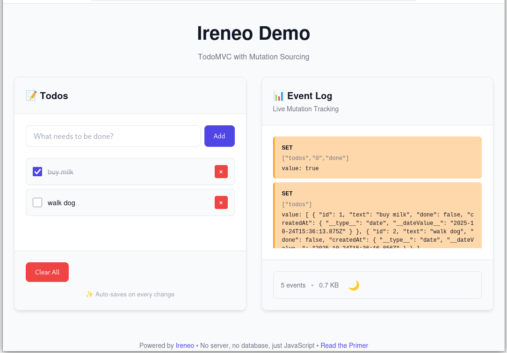

# Ireneo Primer: Mutation Sourcing for JavaScript

## The Persistence Problem

You're building a todo app. Your data model is simple:

```javascript
const state = {
  todos: [
    { id: 1, text: 'Buy milk', done: false },
    { id: 2, text: 'Walk dog', done: true }
  ]
};
```

You mutate it naturally:

```javascript
state.todos.push({ id: 3, text: 'New todo', done: false });
state.todos[0].done = true;
```

**Question**: How do you persist this?

**Traditional answers**:

1. **ORM (Prisma, TypeORM)**: Rewrite your mutations as database calls
   ```javascript
   await db.todo.create({ data: { text: 'New todo' } });
   ```

2. **Manual JSON**: Serialize on every change
   ```javascript
   localStorage.setItem('state', JSON.stringify(state));
   ```

3. **Redux + Middleware**: Write explicit actions
   ```javascript
   dispatch({ type: 'ADD_TODO', payload: {...} });
   ```

All three force you to write extra code. Your natural mutations (`push`, `array[0].done = true`) aren't enough—you need a parallel persistence layer.

**What if JavaScript just remembered?**

---


*This is what we're building in this primer: a todo app where every mutation is automatically captured as events. Todos on the left, live event log on the right. No serialization code, no explicit save calls—just natural JavaScript.*

---

## Memory Image: A Radical Idea

Here's a claim that might sound crazy at first:

> **You don't need a database. You can keep your entire application data in RAM.**

Most developers react with immediate skepticism:
- "What about server restarts? I'll lose everything!"
- "My data won't fit in memory!"
- "RAM is volatile—this can't possibly be safe!"

These concerns are valid—until you realize: **you don't persist your data, you persist the mutations to your data.**

### The Core Insight

**Traditional persistence**: Save snapshots of state to disk/database.
```javascript
// Every time something changes:
await db.save(JSON.stringify(state));  // Write entire state
```

**Memory Image pattern**: Keep state in RAM, save only the changes.
```javascript
// When something changes:
eventLog.append({ operation: 'push', path: ['todos'], value: {...} });

// On restart:
const state = {};
eventLog.replay(state);  // Reconstruct by replaying changes
```

**Why this works**:
1. **Changes are tiny**: A todo app might have 1000 todos (1MB), but each mutation is <1KB
2. **Events are durable**: Write to disk/IndexedDB immediately, just like a database
3. **Recovery is deterministic**: Replay events in order = exact state reconstruction
4. **You CAN fit "entire" app data in RAM**: Most web apps use <100MB of actual data. Your laptop has 8GB+.

**The shocking realization**: For most applications, you don't need Postgres, MySQL, or MongoDB. You need 20 lines of code to log mutations to disk.

### Can My Data Fit?

**Quick check**:
- Open your browser DevTools
- Go to Application → Storage
- Look at your IndexedDB/LocalStorage size

**Most apps**: <10MB of actual data. Even a "large" app (thousands of records) is often <100MB. Modern computers have 8-16GB RAM. You're nowhere near the limit.

**Ireneo's practical limits**:
- ✅ **Sweet spot**: <500MB data, <50K mutations/minute
- ✅ **Works fine**: Up to 2-3GB data on modern hardware (8GB+ RAM)
- ❌ **Not suitable**: Multi-gigabyte datasets, extremely high write throughput (>100K mutations/minute), video/blob storage

> **Note**: The Memory Image pattern itself scales to millions of TPS (see LMAX in [Fowler's article](https://martinfowler.com/bliki/MemoryImage.html)). Ireneo's Proxy-based mutation capture adds overhead, making it better suited for typical application workloads rather than extreme performance scenarios.

**When to use a "real" database**: If you need SQL queries, full-text search, multi-user concurrent writes, or you're genuinely handling gigabytes of relational data. But that's a small minority of JavaScript apps.

### Is It Safe?

**"What if the power goes out?"**

Every mutation is written to durable storage (IndexedDB, file system) immediately—just like a database. The only difference: databases save rows, Ireneo saves operations.

**"What about crashes?"**

Same guarantee as Postgres: committed events survive crashes. Uncommitted changes are lost (use transactions if you need atomicity).

**"What about performance?"**

RAM is 1000x faster than disk. No network roundtrips. No ORM overhead. Most apps become *faster*.

### The Pattern

**On startup**:
1. Load event log from disk
2. Replay events to reconstruct state in RAM
3. App works with plain JavaScript objects (fast, natural)

**During runtime**:
- Mutate objects normally: `state.todos.push(...)`
- Mutations are logged automatically
- Periodic flush to disk (or immediate, your choice)

**On shutdown/crash**:
- Committed events are already on disk
- Next startup: replay events → back to exact state

**The magic**: From your code's perspective, you're just mutating JavaScript objects. Persistence happens transparently.

## Ireneo: Mutation Sourcing in Practice

So how does Ireneo make this transparent? **JavaScript Proxies.**

Every object in your state tree is wrapped in a Proxy that intercepts mutations:
- Property sets: `obj.name = 'Alice'` → logs `{ type: 'SET', path: ['name'], value: 'Alice' }`
- Array operations: `arr.push(item)` → logs `{ type: 'ARRAY_PUSH', path: ['arr'], items: [item] }`
- Deletions: `delete obj.key` → logs `{ type: 'DELETE', path: ['key'] }`

**You write**:
```javascript
root.todos.push({ text: "Buy milk" });
root.todos[0].done = true;
```

**Ireneo automatically logs**:
```json
{ "type": "ARRAY_PUSH", "path": ["todos"], "items": [{...}] }
{ "type": "SET", "path": ["todos", "0", "done"], "value": true }
```

These events are **self-describing**: they contain all information needed to replay them. No command handler classes. No schema migrations when your code changes. Just pure, portable mutation records.

**Contrast with traditional event sourcing** (command-based): You'd write explicit command objects like `AddTodoCommand`, `ToggleTodoCommand`. Ireneo captures mutations automatically instead. _En passant_: you get domain-agnostic event types (`SET`, `PUSH`) rather than domain-specific commands, but this eliminates boilerplate and makes old events replay even after major refactors.

**Benefits**:
- ✅ **Zero boilerplate**: No command classes, no serialization code
- ✅ **Schema evolution is free**: Old events replay with new code (no migration needed)
- ✅ **Domain-agnostic**: Same pattern works for todos, e-commerce, games, anything
- ✅ **Time-travel debugging**: Replay to any point in history
- ✅ **Audit trail**: Every change recorded with path and timestamp

## Building with Ireneo

Let's build a todo app with Ireneo to see how it works in practice.

### What We're Building

- **Left panel**: Todo list (add, toggle, delete)
- **Right panel**: Live event log showing mutations as they happen
- **Persistence**: IndexedDB (survives page reload, no server needed)
- **Deployment**: Single HTML file (~150KB), works offline

**Why a todo app?** It's the TodoMVC standard—every JavaScript framework proves itself with todos. It's familiar, and it demonstrates the key mutation patterns: array operations, property updates, and nested changes.

### Architecture

```
┌─────────────────────────────────────┐
│  Layer 3: UI (HTML + rendering)     │  ← What users see
├─────────────────────────────────────┤
│  Layer 2: App Logic (mutations)     │  ← Your domain code
├─────────────────────────────────────┤
│  Layer 1: Ireneo Persistence        │  ← Automatic tracking
│  (IndexedDB + Transaction + Proxy)  │
└─────────────────────────────────────┘
```

**Key insight**: You only write Layer 2 and 3. Layer 1 is Ireneo doing its thing automatically.

Let's build bottom-up, starting with persistence.

### Layer 1: Persistence Setup

This is the **only** persistence code you write for the entire app:

```javascript
import { createIndexedDBEventLog, createTransaction } from 'ireneo';

// 1. Create event log (persistent storage in browser)
const eventLog = createIndexedDBEventLog('todo-app', 'events');

// 2. Create transaction (loads from event log if it exists)
const txn = await createTransaction(eventLog);

// 3. Get root object (this is your app's state)
const root = txn.root;

// 4. Initialize structure (only runs once, on first load)
if (!root.todos) {
  root.todos = [];
  root.nextId = 1;
}

// DONE! Now all mutations to `root` are tracked automatically.
```

**What just happened?**

**Line 4**: `createIndexedDBEventLog()` creates a persistent event log stored in your browser's IndexedDB. No server, no configuration—it's just there.

**Line 7**: `createTransaction()` does two things:
- If the event log is empty (first run): Creates `root = {}`
- If the event log has events (subsequent runs): Replays all events to reconstruct `root`

Think of it like a database migration, but automatic. Every time you load the app, Ireneo replays your event history to rebuild the exact state you left off with.

**Line 10**: `root` is a **Proxy**. When you mutate it (e.g., `root.todos.push(...)`), the Proxy intercepts that operation and logs it as an event. But from your perspective, it's just a normal JavaScript object.

**Lines 13-16**: First-time initialization. Since `root` starts empty on the first run, we set up the structure. On subsequent runs, `root.todos` already exists (restored from events), so this block is skipped.

**The payoff**: After this 20-line setup, you never think about persistence again. Just mutate `root` naturally, and Ireneo handles everything.

### Layer 2: Application Logic

Now let's implement todo operations. **Just mutate `root` naturally**—Ireneo captures everything.

**Adding a todo**:

```javascript
function addTodo(text) {
  root.todos.push({
    id: root.nextId++,
    text: text,
    done: false,
    createdAt: new Date()
  });
}

// Usage:
addTodo('Buy milk');

// Ireneo automatically logged 2 events:
// 1. SET root.nextId = 2
// 2. ARRAY_PUSH root.todos with new todo object
```

**Toggling done status**:

```javascript
function toggleTodo(id) {
  const todo = root.todos.find(t => t.id === id);
  if (todo) {
    todo.done = !todo.done;
  }
}

// Usage:
toggleTodo(1);

// Ireneo logged:
// SET root.todos[0].done = true
```

**Deleting a todo**:

```javascript
function deleteTodo(id) {
  const index = root.todos.findIndex(t => t.id === id);
  if (index >= 0) {
    root.todos.splice(index, 1);
  }
}

// Usage:
deleteTodo(1);

// Ireneo logged:
// ARRAY_SPLICE root.todos at index 0, delete count 1
```

**Saving changes**:

```javascript
async function save() {
  await txn.save();  // Commits all logged events to IndexedDB
  console.log(`Saved ${root.todos.length} todos`);
}
```

**Notice what's NOT here**:
- No `await db.todo.create()` calls
- No `JSON.stringify()` or manual serialization
- No `dispatch({ type: 'ADD_TODO' })` actions
- **Just plain JavaScript mutations**

Ireneo captures everything. Call `save()` when you're ready to persist to IndexedDB (or set up auto-save on every change).

### No SQL Needed: JavaScript IS the Query Language

One of the most underrated benefits of Memory Image: **you query with JavaScript, not SQL or a query DSL.**

With traditional databases:
```javascript
// Prisma ORM
const activeTodos = await db.todo.findMany({
  where: { done: false },
  orderBy: { createdAt: 'desc' }
});

// SQL
const activeTodos = await db.query(
  'SELECT * FROM todos WHERE done = false ORDER BY createdAt DESC'
);
```

With Ireneo:
```javascript
// Just JavaScript
const activeTodos = root.todos
  .filter(t => !t.done)
  .sort((a, b) => b.createdAt - a.createdAt);
```

**A comprehensive example** (filtering, mapping, grouping, aggregation, sorting):

**What we want**: Get incomplete todos from the last 7 days, grouped by category, with count and list of todo texts, sorted by count descending.

**SQL**:
```sql
SELECT
  category,
  COUNT(*) as count,
  ARRAY_AGG(text) as todos
FROM todos
WHERE done = false
  AND created_at > NOW() - INTERVAL '7 days'
GROUP BY category
ORDER BY count DESC;
```

**Ireneo (plain JavaScript)**:
```javascript
const recentIncompleteByCategory = Object.entries(
  // Filtering (WHERE clause) + Grouping (GROUP BY)
  Object.groupBy(
    root.todos.filter(t => !t.done && Date.now() - t.createdAt < 7 * 86400000),
    t => t.category
  )
)
  // Aggregation (COUNT + ARRAY_AGG) + mapping
  .map(([category, todos]) => ({
    category,
    count: todos.length,
    todos: todos.map(t => t.text)
  }))
  // Sorting (ORDER BY count DESC)
  .sort((a, b) => b.count - a.count);
```

**Benefits**:
- ✅ Full power of JavaScript (`.map`, `.filter`, `.reduce`, `.find`, `.some`, `.every`)
- ✅ No impedance mismatch (no translating between JS and SQL)
- ✅ Type-safe with TypeScript (your IDE autocompletes properties)
- ✅ No N+1 queries—everything's in memory
- ✅ Composable with functions, no query builder syntax to learn

This is why "not a good fit" for SQL queries isn't a limitation—you don't NEED SQL when your data is in memory as native JavaScript objects.

### What an Event Looks Like

When you run `addTodo('Buy milk')`, Ireneo logs this event:

```json
{
  "type": "ARRAY_PUSH",
  "path": ["todos"],
  "args": [[{
    "id": 1,
    "text": "Buy milk",
    "done": false,
    "createdAt": "2025-10-23T20:00:00.000Z"
  }]]
}
```

**Breaking it down**:
- `type`: The operation type (`ARRAY_PUSH`, `SET`, `DELETE`, `MAP_SET`, etc.)
- `path`: Where in the object graph (array of property keys: `['todos']` means `root.todos`)
- `args`: Operation-specific data (for `push()`, it's the items being pushed)

When you toggle a todo's `done` status, Ireneo logs:

```json
{
  "type": "SET",
  "path": ["todos", "0", "done"],
  "value": true
}
```

The `path` tells you: "Navigate to `root.todos[0].done` and set it to `true`."

**Why this matters**:
- **Replayable**: Apply events in order, and you perfectly reconstruct state
- **Debuggable**: See exactly what changed, when
- **Portable**: Export events as NDJSON, import on another machine

**Contrast with command sourcing**:
- ❌ Command: `ToggleTodoCommand({ todoId: 1 })`
  → Requires command handler code to exist. If you refactor your code and remove the handler, old events break.
- ✅ Mutation: `SET ['todos', '0', 'done'] = true`
  → Self-describing. Replays without special code. Refactor freely—events still work.

### Layer 3: UI Overview

The UI is simple vanilla JavaScript—no framework needed. Here's the structure:

**HTML**:
```html
<div class="app">
  <!-- Left panel: Todo list -->
  <div class="todos-panel">
    <input id="new-todo" placeholder="What needs to be done?" />
    <ul id="todo-list"></ul>
    <button onclick="loadExample()">Load Example</button>
    <button onclick="clearAll()">Clear All</button>
  </div>

  <!-- Right panel: Event log -->
  <div class="events-panel">
    <h3>Event Log (Live)</h3>
    <div id="event-list"></div>
    <div class="stats">
      <span id="event-count">0 events</span>
    </div>
  </div>
</div>
```

**Rendering**:

Rendering todos is straightforward—map the array to HTML:

```javascript
function render() {
  const list = document.getElementById('todo-list');
  list.innerHTML = root.todos.map(todo => `
    <li class="${todo.done ? 'done' : ''}">
      <input type="checkbox" ${todo.done ? 'checked' : ''}
             onchange="toggleTodo(${todo.id}); render()">
      <span>${todo.text}</span>
      <button onclick="deleteTodo(${todo.id}); render()">×</button>
    </li>
  `).join('');
}
```

**Event log visualization** (the interesting part):

```javascript
async function renderEvents() {
  const events = await eventLog.getAll();
  const recent = events.slice(-20);  // Show last 20

  const html = recent.map(event => `
    <div class="event event-${event.type}">
      <strong>${event.type}</strong>
      <code>${JSON.stringify(event.path)}</code>
    </div>
  `).join('');

  document.getElementById('event-list').innerHTML = html;
  document.getElementById('event-count').textContent =
    `${events.length} events`;
}
```

**Styling** (color-coded events):

```css
.event-ARRAY_PUSH { background: #d1fae5; }  /* Green */
.event-SET { background: #fed7aa; }          /* Amber */
.event-DELETE { background: #fecaca; }       /* Red */
```

**Total complexity**: ~150 lines of HTML + JavaScript + CSS. Nothing fancy—just enough to demonstrate the concept clearly.

For the complete source, see the [demo on GitHub](https://github.com/xrrocha/ireneo/tree/main/src/demo).

## Try It Now

**[Try the live demo →](https://xrrocha.github.io/ireneo.html)**

Or run it locally:
1. Download [`dist/demo.html`](https://github.com/xrrocha/ireneo/raw/main/dist/demo.html) — one self-contained 33KB file
2. Open in your browser (works with `file://` protocol—no server needed)
3. Click **"Load Example"** to populate sample todos

**What to observe**:
- **Add a todo** → Watch an `ARRAY_PUSH` event appear in the event log
- **Toggle a checkbox** → See a `SET` event with path `['todos', 0, 'done']`
- **Delete a todo** → Notice an `ARRAY_SPLICE` event
- **Reload the page** → Your todos are still there! (Persisted via IndexedDB)

The side-by-side view makes it visceral: every mutation you make creates an event. No commands to write, no serialization code—just natural JavaScript.

## Beyond Todos

The same pattern scales to any JavaScript application:

**E-commerce**:
```javascript
root.cart.items.push({ productId: 123, quantity: 2 });
root.user.preferences.theme = 'dark';
root.orders.push({ id: 456, total: 99.99, items: [...] });
```

**Collaborative editing**:
```javascript
root.document.title = "Meeting Notes";
root.document.paragraphs[3].text = "Updated content";
// Sync events to server → other clients replay them → real-time collaboration
```

**Game state**:
```javascript
root.player.position = { x: 100, y: 200 };
root.inventory.items.push({ type: 'sword', damage: 15 });
// Save/load via event replay, time-travel debugging for free
```

### When to Use Ireneo

✅ **Good fit**:
- Need audit trail or time-travel debugging
- Rapid prototyping (zero schema maintenance as you evolve)
- Offline-first apps (local persistence, sync later)
- Single-process apps where data fits comfortably in RAM (see sizing discussion above)

❌ **Not a good fit**:
- Need SQL queries, full-text search, or complex indexing
- Multiple processes writing concurrently (use a real database)
- Streaming append-only data (use Kafka, event log systems)
- Video/blob storage or truly massive datasets (10GB+)

Ireneo excels at **application state persistence** for single-process JavaScript apps. It's not trying to replace PostgreSQL—it's trying to make persistence disappear for the 80% of apps that don't need a heavyweight database.

## Next Steps

**Install**:
```bash
npm install ireneo
```

**Read more**:
- [README.md](../README.md) - Complete API reference
- [Theory](./theory.md) - Deep dive into memory image pattern
- [Source code](https://github.com/xrrocha/ireneo) - Explore the implementation

**Build something**!

The best way to understand mutation sourcing is to use it. Start with a simple app (maybe not even a todo list—your own idea!), set up Ireneo in 20 lines, and watch your mutations get captured automatically.

Welcome to persistence without the ceremony.
