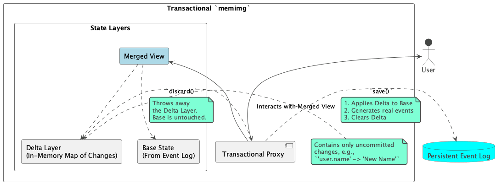

# The Theoretical Foundations and Design of Ireneo

## Abstract

Ireneo is a JavaScript library that provides transparent, event-sourced persistence for in-memory object graphs. It is a sophisticated, dynamic re-interpretation of the classical **Memory Image** (or **System Prevalence**) architectural pattern. Its core innovation is the use of **Mutation Sourcing** over traditional Command Sourcing, achieved via JavaScript's metaprogramming (`Proxy`) features. This approach creates a fully transparent "Imperative Shell" over a deterministic "Functional Core," allowing developers to mutate objects naturally while the system automatically logs low-level state changes. This design dramatically simplifies development, enhances flexibility, and provides a more robust solution to schema evolution compared to classical implementations. This document details the theoretical foundations of this approach and maps them to the design decisions in the TypeScript implementation.

---

## Part I: The Theoretical Foundations of Ireneo

This section outlines the core theory, situating Ireneo within established architectural patterns and detailing its innovative departures.

### 1. The Classical Pattern: Memory Image and Command Sourcing

The architectural pattern known as Memory Image (Martin Fowler) or System Prevalence (Prevayler) provides a high-performance alternative to traditional database-centric architectures. Its principles, synthesized from sources like Fowler, `kIreneo`, and Prevayler, are as follows:

-   **In-Memory State**: The entire application's object model (the "prevalent system") is held live in main memory. This eliminates database round-trips and object-relational mapping, leading to significant performance gains and simpler, richer domain models.
-   **Durability via Logging**: To survive crashes, every operation that changes the system's state is first recorded in a persistent, append-only log.
-   **Command Sourcing**: The unit of logging is a **`Command`** (or `Transaction`). This is a serializable object, explicitly written by the developer, that encapsulates a single, logical state change (e.g., `new CreateAccount(id, name)`, `new Deposit(accountId, amount)`). The log is a history of these domain-specific commands.
-   **Recovery via Replay**: On startup, the system state is rebuilt by creating a new, empty object model and re-executing every `Command` from the log in its original order.
-   **Snapshots**: To avoid replaying an entire (potentially massive) log, the system periodically saves a complete snapshot of the in-memory state. Recovery then involves loading the latest snapshot and replaying only the commands that occurred since.

This classical pattern is robust and explicit, but it carries significant developer ceremony and architectural rigidity.

### 2. Ireneo's Core Thesis: A Dynamic Re-interpretation

Ireneo embraces the core benefits of the Memory Image pattern but rejects its traditional implementation. Its central thesis is:

> By logging low-level **mutations** instead of high-level **commands**, and by leveraging dynamic proxies to do so transparently, we can achieve the full benefits of in-memory persistence while freeing the developer from the rigidity of Command Sourcing.

This leads to a system that is more flexible, easier to evolve, and more natural to use within a dynamic language environment like JavaScript.

### 3. Key Theoretical Pillar: Mutation Sourcing vs. Command Sourcing

This is the most significant departure Ireneo makes from the classical pattern. It provides a more flexible and evolution-resistant approach to persistence.


-   **Simplified Development & Exploration**: The cognitive load for the developer is virtually zero. There is no persistence-related API to learn or command hierarchy to maintain. You can improvise and evolve the object model freely. The persistence mechanism automatically adapts to any mutation, enabling an agile and exploratory programming style that is natural to dynamic languages.

-   **Simplified Schema Evolution**: This is the critical long-term benefit. In a Command Sourced system, changing a command's signature creates a versioning crisis. The event log contains legacy commands, and the system must be explicitly taught how to handle or migrate them. With Mutation Sourcing, this problem is largely eliminated. The event log contains a history of fundamental state changes (`SET`, `DELETE`, `ARRAY_PUSH`), not a history of code execution. You can freely refactor your application's business logic and methods without invalidating the historical event log.

### 4. Key Architectural Pillar: The Imperative Shell over a Functional Core

The Ireneo architecture is best understood as two distinct layers.

-   **The Functional Core**: This is the pure, conceptual foundation. It holds that `State = fold(events)`. The event log is the single source of truth, and the system state is a deterministic, reproducible projection of that log.
-   **The Imperative Shell**: This is the pragmatic, "magic" layer that makes the functional core usable. It allows developers to write simple, imperative code while the shell translates these actions into the events that feed the functional core. This shell is built entirely out of JavaScript's `Proxy` objects, making the underlying functional reality completely transparent.


### 5. Transactional Integrity via Delta Layering

To support the "draft state" workflows common in interactive applications, Ireneo adds a transactional layer on top of the core engine. This is a classic delta-tracking architecture.

-   **Three-Tiered State**:
    1.  **Base State**: The last known-good state, loaded from a snapshot and/or the event log. It is considered immutable within the transaction.
    2.  **Delta Layer**: An in-memory `Map` of pending changes, where keys are object paths and values are the new data.
    3.  **Merged View**: A special "transactional proxy" presents a virtual, unified view of the state by first checking the delta layer for a value and falling back to the base state if not found.

-   **`save()` (Commit)**: Applies the changes from the delta to the base state. It is only at this moment that the real, persistent mutation events are generated and logged.
-   **`discard()` (Rollback)**: A computationally cheap operation that simply throws the delta away, leaving the base state untouched.



### 6. On the Evolution of the Implementation

While the theoretical foundations outlined above remain constant, the implementation has undergone continuous refinement. The principles of mutation sourcing, imperative-over-functional layering, and delta tracking are architectural invariants. However, specific design patterns—such as the Strategy pattern for collection handling, branded types for compile-time safety, and granular key tracking for nested collections—represent evolutionary improvements that strengthen the implementation without altering its theoretical basis. Part II documents both the foundational design decisions and these subsequent refinements.

---

## Part II: Design and Implementation Analysis

This section maps the theory from Part I to the concrete design decisions in the Ireneo TypeScript codebase, focusing on the *why* behind the implementation.

### `memimg.ts` (The Public API & Orchestrator)

-   **Design**: Exposes a minimal, clean API surface (`createMemoryImage`, `createTransaction`, etc.). This follows the principle of encapsulation, hiding the complex internal machinery (proxies, eventing, serialization) from the consumer.
-   **Decision**: The use of a global `WeakMap` (`proxiedRegistry`) to associate root proxies with their internal tracking infrastructure (`ProxyInfrastructure`) is a deliberate design choice. The alternative would be to attach metadata directly to the user's object (e.g., `root.__ireneo = ...`), which would pollute the object and violate the principle of transparency. The `WeakMap` provides this association externally and, crucially, prevents memory leaks by not holding a strong reference to the root object.

### `proxy.ts` & `collection-wrapper.ts` (The Imperative Shell)

-   **Design**: This is the implementation of the Imperative Shell, where the core "magic" happens.
-   **Decision (`wrapIfNeeded`)**: The "wrap-before-recurse" strategy is the chosen solution to the circular reference problem. By immediately creating and registering a proxy for an object *before* traversing its children, the system can handle graphs of any complexity without infinite loops. When a circular reference is encountered, the already-registered proxy is simply returned.
-   **Decision (`get` trap)**: The design of the `get` trap with a dual responsibility is a powerful pattern that fully leverages JavaScript's dynamic nature. It performs "Just-in-Time" Proxification, wrapping nested objects and collection methods at the moment they are accessed. This is more efficient than a full upfront traversal and makes the system feel instantaneous.


-   **Decision (`collection-wrapper.ts`)**: The logic for wrapping Array, Map, and Set methods was refactored into a single, data-driven function. This is a design choice for maintainability and adherence to the DRY (Don't Repeat Yourself) principle, as proven by its focused unit tests. The specific methods that are wrapped are defined in the `MUTATING_ARRAY_METHODS`, `MUTATING_MAP_METHODS`, and `MUTATING_SET_METHODS` constants in `src/Ireneo/constants.ts`, which provides a single source of truth.

### `event-handlers.ts` (The Event Registry)

-   **Design**: Implements the **Registry** and **Strategy** design patterns for handling the 18 different mutation types.
-   **Decision**: This design explicitly avoids a monolithic `switch` statement for event creation and application. By giving each event type its own handler class (`SetEventHandler`, `ArrayPushHandler`, etc.), the logic for each mutation is cleanly decoupled. This makes the system easily extensible and independently testable, as demonstrated by the exhaustive tests in `event-handlers.test.ts`.

### `type-classifier.ts` (Foundation: Type Classification)

-   **Design**: Provides a centralized, single source of truth for classifying JavaScript values. It uses the `ValueCategory` enum to categorize every possible JavaScript type (`string`, `number`, `Date`, `Map`, etc.).
-   **Decision**: Centralizing type-checking in this module eliminates dozens of scattered `typeof` and `instanceof` checks throughout the codebase. This is a crucial design choice for maintainability and consistency. For example, the `isObject` helper function in `src/js-types.ts` (re-exported by `type-classifier.ts`) defines that for Ireneo, functions are considered objects, which is a key detail for the proxying logic. This avoids ambiguity and ensures that all parts of the system agree on what constitutes an "object", a "collection", or a "primitive".

### `path-navigator.ts` (Unified Path Navigation)

-   **Design**: A focused utility module providing Map/Set-aware navigation through object graphs.
-   **Decision**: This module was extracted to eliminate approximately 60 lines of duplicated navigation logic previously scattered across `transaction.ts`, `replay.ts`, and other files. The decision to extract this common pattern follows the DRY (Don't Repeat Yourself) principle and establishes a single, well-tested implementation as the source of truth for path traversal.
-   **Decision (Map Awareness)**: A critical design insight is that Maps require special navigation (`map.get(key)` vs `object[key]`). Rather than embedding this conditional logic throughout the codebase, `path-navigator` encapsulates it, making Map-handling logic explicit and centralized. This design choice proved essential for the subsequent nested collection fix.
-   **Design Pattern**: Utility module with focused responsibility—navigation only, no mutation or proxification concerns.

### `collection-strategy.ts` (Data-Driven Collection Handling)

-   **Design**: Implements the **Strategy pattern** for collection-specific behavior (Array, Map, Set), replacing imperative if/else chains with a polymorphic, data-driven approach.
-   **Decision**: Prior implementations used repeated conditional logic to handle collection differences. The Strategy pattern eliminates approximately 50 lines of duplication and makes the system extensible—adding a new collection type (e.g., hypothetical `OrderedMap`) requires only defining a new strategy, not modifying multiple call sites.
-   **Decision**: This design is consistent with the earlier `collection-wrapper.ts` refactoring, which also adopted a data-driven approach. The consistency reinforces that collection-handling logic should be declarative rather than imperative.
-   **Design Pattern**: Strategy + Registry. Each `CollectionStrategy` encapsulates type detection, method names, and collection-specific operations, selected at runtime based on the target value's type.

### `types.ts` (Branded Types for Compile-Time Safety)

-   **Design**: Leverages TypeScript's **branded types** to distinguish proxied values (`Proxied<T>`) from unwrapped values (`Target<T>`) at compile time.
-   **Decision**: The proxy-vs-target confusion was identified as a subtle but critical bug class. Functions expecting unwrapped objects receiving proxies (or vice versa) cause runtime failures. Branded types make these errors impossible to compile, providing a zero-runtime-cost safety mechanism.
-   **Decision (Implementation)**: Uses TypeScript's `unique symbol` as a compile-time-only brand. This ensures no runtime overhead—the brand exists solely in the type system and is erased during compilation. The helper functions `asProxied()` and `asTarget()` provide safe casting when crossing the proxy boundary.
-   **Impact**: Revealed approximately 50 unsafe call sites that compiled successfully but were architecturally fragile. The type system now enforces correct usage.

```typescript
// Compile-time brand (zero runtime cost)
declare const ProxiedBrand: unique symbol;
type Proxied<T> = T & { [ProxiedBrand]: true };

// Enforced safety
function unwrap(proxied: Proxied<any>): Target<any> { ... }
unwrap(plainObject);  // ❌ Compile error: not branded as Proxied
```

### `class-registry.ts` & `instance-reconstructor.ts` (Class Instance Preservation)

-   **Design**: Enables serialization and deserialization of class instances with their methods and prototype chains intact.
-   **Problem**: JSON serialization loses class identity. `JSON.parse()` returns plain objects without methods or prototypes, breaking object-oriented code that relies on instance methods.
-   **Decision**: During serialization, class instances are tagged with `__class__: className`. During deserialization, `Object.create(Constructor.prototype)` reconstructs instances with the correct prototype chain, bypassing the constructor to avoid side effects.
-   **Decision (Constructor Bypass)**: Using `Object.create()` instead of `new Constructor()` is a deliberate choice. Deserialization restores *state*, not freshly constructed objects. Constructor side effects (logging, ID generation, etc.) should not re-execute. This is the standard pattern for ORM hydration.
-   **Trade-off**: Private fields (JavaScript `#field` syntax) are not serializable, as they are not enumerable. Documentation recommends TypeScript `private` (compile-time only) for persisted data.

```typescript
// Serialization captures class name
{ __class__: 'Employee', empno: 7839, ename: 'KING' }

// Deserialization reconstructs prototype
const instance = Object.create(Employee.prototype);
Object.assign(instance, data);
// instance.greet() ✓ works, instanceof Employee ✓ true
```

### `serialize.ts` & `deserialize.ts` (State Marshalling)

-   **Design**: Implements the logic for creating snapshots and handling object identity across the serialization boundary.
-   **Decision (`CycleTracker` strategy)**: The use of a strategy pattern with two implementations (`SnapshotCycleTracker`, `EventCycleTracker`) is a deliberate design choice. It allows the same core serialization engine to be used for two different contexts—a full snapshot versus a single event value—without duplicating the complex type-handling logic.
-   **Decision (Two-Pass Deserialization)**: The design of deserialization—first building the object structure with placeholders for references, then resolving them in a second pass—is a standard and robust computer science solution to the problem of handling forward references in a serialized graph.
-   **Decision (Date Object Handling)**: The specific logic to serialize and deserialize `Date` objects while preserving any custom properties attached to them is a direct result of iterative design and testing. The `date-object-properties.test.ts` file was created specifically to prove the existence of a bug in the initial, simpler implementation and to validate its fix.

### `transaction.ts`, `delta-manager.ts`, `transaction-proxy.ts` (The Transactional Layer)

-   **Design**: A layered architecture implementing the delta-tracking pattern with granular key tracking for Map collections.
-   **Decision**: The choice of delta tracking over a full copy-on-write for transactions is a **performance-oriented decision**. It is optimized for the common case in interactive applications: many small, localized mutations.
-   **Decision**: The decomposition of the transaction logic into multiple files (`delta-manager.ts`, `proxy-unwrapper.ts`, `transaction-proxy.ts`) is a design choice for **separation of concerns**, allowing each component to be reasoned about and tested in isolation.
-   **Decision (Granular Key Tracking)**: A critical architectural fix was implemented in `transaction-proxy.ts` to store individual Map keys at extended paths rather than entire Map objects. Prior to this, `delta.set('outer', entireMapCopy)` stored complete Maps, causing stale child references during `save()`. The fix stores Map mutations as `delta.set('outer.inner', value)`, treating Map keys analogously to object properties. This resolved a months-long limitation where nested Map mutations were lost.
-   **Design Insight**: The granular key tracking aligns Map behavior with object property mutations. Just as `obj.user.age = 30` creates a delta entry at path `['user', 'age']`, now `map.get('user').age = 30` also creates a granular delta entry. This consistency makes the system more predictable and enables arbitrarily deep nesting of Maps.

```typescript
// Before: Whole Map stored (stale children)
delta.set('outer', new Map(outerMap));  // ❌ Loses nested changes

// After: Individual keys stored (granular tracking)
delta.set('outer.inner', innerMapValue);  // ✓ Preserves all mutations
delta.set('outer.inner.key', actualValue);
```

### `event-log.ts` (Pluggable Persistence)

-   **Design**: An interface-based, pluggable architecture.
-   **Decision**: This design completely **decouples the core engine from any specific storage technology**. By defining a simple `EventLog` interface, Ireneo can be used in Node.js (file system), browsers (IndexedDB, LocalStorage), or with a custom remote backend. The use of **NDJSON** (Newline Delimited JSON) for the file-based log is a specific choice favoring streamability and append-only resilience.

### The Test Suite (`test/`)

-   **Design**: A comprehensive, multi-tiered testing strategy (unit, integration, browser).
-   **Decision**: The test suite's structure is a reflection of the system's design. Integration tests (`circular-references.test.ts`, `persistence.test.ts`) validate the high-level theoretical concepts, while unit tests validate the individual design decisions within each module. The browser tests (`event-log-browser.spec.ts`) show a commitment to ensuring the design works across different JavaScript environments.
-   **Current State**: 657 tests with 656 passing (99.8% pass rate), achieving 94.74% code coverage. This comprehensive suite validates both theoretical concepts and implementation details.

### Architectural Evolution: The October 2025 Refactoring

The implementation underwent a systematic, multi-phase refactoring in October 2025 that strengthened the architectural foundation without altering its theoretical basis. This evolution demonstrates how the core principles (mutation sourcing, imperative-over-functional, delta layering) remain constant while specific patterns mature.

**Phase 2: Type Safety Migration**
-   **Motivation**: Proxy-vs-target confusion caused subtle runtime bugs.
-   **Solution**: Branded types (`Proxied<T>`, `Target<T>`) made unsafe usages impossible to compile.
-   **Impact**: Revealed ~50 fragile call sites; zero runtime cost.

**Phase 1: Path Navigator Extraction**
-   **Motivation**: ~60 lines of duplicated path navigation logic across `transaction.ts`, `replay.ts`, and others.
-   **Solution**: Extracted `path-navigator.ts` as single source of truth with Map/Set awareness.
-   **Impact**: Eliminated duplication; centralized Map-handling logic.

**Phase 3: Collection Strategy Pattern**
-   **Motivation**: Repeated if/else chains for collection type handling (~50 lines duplication).
-   **Solution**: Implemented Strategy pattern in `collection-strategy.ts`.
-   **Impact**: Extensible, data-driven collection handling; consistent with `collection-wrapper.ts` design.

**Phase 4: Root Cause Documentation**
-   **Motivation**: Nested collection mutations didn't persist correctly (known limitation for months).
-   **Solution**: Comprehensive technical analysis in `docs/nested-collection-limitations.md`.
-   **Impact**: Documented root cause (flat delta storage of entire Maps), proposed granular key tracking.

**Phase A: Nested Collection Fix**
-   **Motivation**: Resolve nested collection limitation identified in Phase 4.
-   **Solution**: Implemented granular key tracking—store `delta.set('map.key', value)` instead of `delta.set('map', entireMap)`.
-   **Impact**: ~130 lines refactored in `transaction-proxy.ts`; nested Maps now fully functional; zero regressions.
-   **Timeline**: Completed in 1 day vs. estimated 1-2 weeks, demonstrating value of thorough analysis (Phase 4).

**Cumulative Impact**: Eliminated ~110 lines of duplication, resolved critical limitation, strengthened type safety, maintained theoretical integrity. All phases validated by comprehensive test suite.

### Current State and Production Readiness

**Module Structure**: The codebase comprises 23 core modules organized by responsibility:
-   **Foundation**: `types.ts`, `js-types.ts`, `type-classifier.ts`
-   **Core Engine**: `proxy.ts`, `collection-wrapper.ts`, `collection-strategy.ts`, `path-navigator.ts`
-   **Eventing**: `event-handlers.ts`, `replay.ts`
-   **Serialization**: `serialize.ts`, `deserialize.ts`, `class-registry.ts`, `instance-reconstructor.ts`
-   **Transactions**: `transaction.ts`, `transaction-proxy.ts`, `delta-manager.ts`, `proxy-unwrapper.ts`
-   **Storage**: `event-log.ts` (4 implementations: in-memory, filesystem, IndexedDB, LocalStorage)
-   **Public API**: `memimg.ts`, `index.ts`

**Test Coverage**: 657 tests (656 passing, 99.8%) with 94.74% code coverage. Test suite includes:
-   ~600 unit tests across 15 files
-   ~57 integration tests across 7 files
-   Browser-specific tests for IndexedDB/LocalStorage backends

**Production Readiness**: The system is production-ready with documented caveats:
-   ✅ **Strengths**: Comprehensive test coverage, zero dependencies, universal runtime support (Node.js, browsers, Deno, Bun), class instance preservation, nested collections fully supported.
-   ⚠️ **Known Limitations**: JavaScript private fields (`#field`) not serializable (use TypeScript `private`), WeakMap/WeakSet/Promise not serializable by design, one failing test (browser-specific edge case documented).
-   📖 **Documentation**: Comprehensive theory document (this file), RFC (`docs/ireneo-rfc.md`), test documentation (`test/README.md`), architectural decision records in commit history.

**Demonstrated Capabilities**: TodoMVC demo application (`src/demo/`) showcases transparent persistence, real-time event log visualization, IndexedDB storage, and class instance methods working across page reloads.

### Durability and Recovery (Snapshotting)

This diagram illustrates the role of snapshots in ensuring fast recovery.


